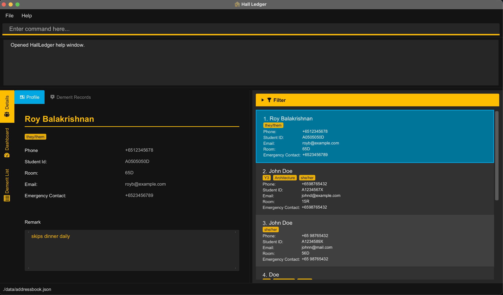

# HallLedger User Guide

**HallLedger** is a desktop app for **Resident Assistants (RAs)** and hall administrators who need to manage resident records quickly and accurately. It is designed for users who prefer a **command-line driven workflow**, while still providing a GUI for viewing and verifying resident information.

HallLedger is intended for hall-level administration tasks such as:
- maintaining resident contact details,
- organizing residents using hall-relevant tags,
- recording quick operational remarks,
- and tracking resident demerit incidents in a structured way.

If you are a fast typist managing many residents, HallLedger helps you work faster than spreadsheets or mouse-heavy interfaces.

<page-nav-print />

--------------------------------------------------------------------------------------------------------------------

## Quick start

1. Ensure you have **Java 17** or above installed on your computer.  
   **Mac users:** Ensure you are using the precise JDK version prescribed by the course.

2. Download the latest `hallledger.jar` file from the project release page.

3. Copy the jar file into the folder you want to use as the **home folder** for HallLedger.

4. Open a command terminal, `cd` into that folder, and run:

   `java -jar hallledger.jar`

5. A GUI similar to the one below should appear in a few seconds. Note that the app starts with sample data.

   

6. Type commands into the command box and press <kbd>Enter</kbd> to execute them.

7. Some example commands you can try:

   * `list`
   * `add n=John Doe p=+6598765432 e=johnd@example.com i=A1234567X r=15R ec=+65 91234567`
   * `find n=John`
   * `tag i=A1234567X y=Y2 m=Computer Science g=Male`
   * `remark i=A1234567X rm=Peanut allergy`
   * `demeritlist`
   * `demerit i=A1234567X di=18 rm=Visitor during quiet hours`
   * `delete i=A1234567X`
   * `clear`
   * `exit`

8. Refer to the [Features](#features) section below for full details.

--------------------------------------------------------------------------------------------------------------------

## Features

<box type="info" seamless>

**Notes about the command format**

* Words in `UPPER_CASE` are placeholders you should replace with your own values.  
  Example: in `add n=NAME`, replace `NAME` with something like `John Doe`.

* Items in square brackets are optional.  
  Example: `demerit i=STUDENT_ID di=RULE_INDEX [rm=REMARK]` can be used with or without `rm=`.

* Parameters can usually be entered in any order unless stated otherwise.

* If you are using the PDF version of this guide, copy commands carefully if they span multiple lines.

</box>

---

### Viewing help: `help`

Shows the Help window.

Format: `help`

Use this command when you want a quick reminder of the available commands inside the app.

---

### Adding a resident: `add`

Adds a resident to HallLedger.

Format:  
`add n=NAME p=PHONE e=EMAIL i=STUDENT_ID r=ROOM_NUMBER ec=EMERGENCY_CONTACT`

Examples:
* `add n=John Doe p=+6598765432 e=johnd@example.com i=A1234567X r=15R ec=+65 91234567`
* `add n=Mary Tan p=+6591122233 e=marytan@example.com i=A7654321Z r=8B ec=+65 92345678`

Expected result:
* the resident is added to the resident list,
* and the result box shows a success message.

Notes:
* `STUDENT_ID` should uniquely identify a resident.
* HallLedger validates the input format and rejects invalid values.

---

### Listing all residents: `list`

Shows all residents currently stored in HallLedger.

Format:  
`list`

Use this command to return to the full resident list after using `find`.

---

### Editing a resident: `edit`

Edits an existing resident identified by student ID.

Format:  
`edit STUDENT_ID [n=NAME] [p=PHONE] [e=EMAIL] [i=NEW_STUDENT_ID] [r=ROOM_NUMBER] [ec=EMERGENCY_CONTACT]`

Examples:
* `edit A1234567X p=+6591234567 e=johndoe@example.com`
* `edit A7654321Z n=Mary Ann Tan`
* `edit A1234567X r=16A ec=+65 99887766`

Expected result:
* only the fields you specify are updated,
* all other fields remain unchanged.

Notes:
* The first `STUDENT_ID` identifies which resident to edit.
* If you use `i=NEW_STUDENT_ID`, HallLedger updates the resident’s student ID.
* At least one field to edit must be provided.

---

### Deleting a resident: `delete`

Deletes the resident identified by student ID.

Format:  
`delete i=STUDENT_ID`

Example:
* `delete i=A1234567X`

Expected result:
* HallLedger opens a confirmation dialog before deletion.
* If you confirm, the resident is deleted.
* If you cancel, the resident remains unchanged and HallLedger shows `Deletion cancelled.`

Notes:
* Invalid delete commands do **not** open the confirmation dialog.

---

### Finding residents: `find`

Finds residents using one or more search criteria.

HallLedger supports searching by selected fields using prefixes.

Format:  
`find [n=NAME] [p=PHONE] [e=EMAIL] [i=STUDENT_ID] [r=ROOM_NUMBER] [ec=EMERGENCY_CONTACT] [y=YEAR] [m=MAJOR] [g=GENDER]`

Examples:
* `find n=John`
* `find i=A1234567X`
* `find r=15R`
* `find y=Y2 m=Computer Science`
* `find g=Male y=Y1`

Expected result:
* the resident list is filtered to match your search criteria.

Notes:
* `find` is useful for narrowing the list before reviewing details in the tabs.
* Different prefixes can be combined in one command.

---

### Tagging a resident: `tag`

Adds or updates a resident’s tag values.

HallLedger supports three tag categories:
* **Year**
* **Major**
* **Gender**

Format:  
`tag i=STUDENT_ID [y=YEAR] [m=MAJOR] [g=GENDER]`

Examples:
* `tag i=A1234567X y=Y2`
* `tag i=A1234567X m=Computer Science g=Male`
* `tag i=A7654321Z y=Y1 m=Business g=Female`

Expected result:
* the selected resident’s tag values are updated.

Notes:
* At least one of `y=`, `m=`, or `g=` must be provided.
* HallLedger keeps at most one value per supported tag category for each resident.

---

### Adding or updating a remark: `remark`

Adds or updates the resident-level remark for a resident.

Format:  
`remark i=STUDENT_ID rm=REMARK`

Examples:
* `remark i=A1234567X rm=Peanut allergy`
* `remark i=A7654321Z rm=Late check-in due to flight delay`

Expected result:
* the resident’s remark is updated,
* and the result box shows the new remark.

Use this for short operational notes that are useful during hall administration.

---

### Viewing the demerit rule list: `demeritlist`

Displays the supported demerit rule list.

Format:  
`demeritlist`

Use this command when you want to check the rule index before applying a demerit incident.

Expected result:
* HallLedger shows the available demerit rules and their indices in the result area.

---

### Adding a demerit incident: `demerit`

Adds a demerit incident to a resident identified by student ID.

Format:  
`demerit i=STUDENT_ID di=RULE_INDEX [rm=REMARK]`

Examples:
* `demerit i=A1234567X di=18`
* `demerit i=A1234567X di=18 rm=Visitor during quiet hours`
* `demerit i=A7654321Z di=21 rm=Excessive noise after midnight`

Expected result:
* HallLedger applies the specified demerit rule to the resident,
* computes the correct offence number for that resident and rule,
* adds the corresponding points,
* updates the resident’s total demerit points,
* and shows the incident in the **Demerit Records** tab.

The success message includes:
* the resident,
* the rule applied,
* the demerit remark,
* the points added,
* and the updated total demerit points.

Notes:
* Repeating the same rule for the same resident increases the offence number for that rule.
* Different rules track offences independently.
* The optional `rm=` field lets you record case-specific context for the incident.

---

### Clearing all residents: `clear`

Clears all resident records from HallLedger.

Format:  
`clear`

Use this only when you really want to remove all current resident data from the active data file.

---

### Exiting the app: `exit`

Exits HallLedger.

Format:  
`exit`

---

### Saving data

HallLedger saves data automatically after every command that changes the resident data.  
There is no manual save command.

---

### Editing the data file

HallLedger stores data in:

`[JAR file location]/data/addressbook.json`

Advanced users can edit this file directly.

<box type="warning" seamless>

**Warning:**  
If the file is edited into an invalid format, HallLedger may fail to read it correctly.  
If you manually edit the data file, make a backup first.

</box>

--------------------------------------------------------------------------------------------------------------------

## FAQ

**Q: Nothing happens when I double-click the jar file. What should I do?**  
**A:** Some systems do not launch Java jars correctly by double-clicking. Open a terminal in the jar’s folder and run `java -jar hallledger.jar` instead.

**Q: Why does HallLedger fail to save data?**  
**A:** HallLedger needs write access to its folder. If the app is placed inside a write-protected folder, saving may fail.

**Q: How do I return to the full resident list after filtering it?**  
**A:** Run `list`.

**Q: How do I know which demerit rule index to use?**  
**A:** Run `demeritlist` first.

**Q: Can I manually edit `addressbook.json`?**  
**A:** Yes, but HallLedger expects the file structure and values to remain valid.

--------------------------------------------------------------------------------------------------------------------

## Known issues

1. If HallLedger is moved to a secondary display and that display is later removed, the app window may reopen off-screen.  
   Workaround: delete the `preferences.json` file and relaunch the app.

2. On some systems, double-clicking the jar file may not launch the app reliably.  
   Workaround: launch the app from a terminal using `java -jar hallledger.jar`.

3. HallLedger may not function correctly if it is placed in a write-protected folder.

4. macOS users using fullscreen mode may encounter unexpected behavior with secondary dialogs such as the Help window.

--------------------------------------------------------------------------------------------------------------------

## Command summary

| Action | Format |
| --- | --- |
| **Help** | `help` |
| **Add** | `add n=NAME p=PHONE e=EMAIL i=STUDENT_ID r=ROOM_NUMBER ec=EMERGENCY_CONTACT` |
| **List** | `list` |
| **Edit** | `edit STUDENT_ID [n=NAME] [p=PHONE] [e=EMAIL] [i=NEW_STUDENT_ID] [r=ROOM_NUMBER] [ec=EMERGENCY_CONTACT]` |
| **Delete** | `delete i=STUDENT_ID` |
| **Find** | `find [n=NAME] [p=PHONE] [e=EMAIL] [i=STUDENT_ID] [r=ROOM_NUMBER] [ec=EMERGENCY_CONTACT] [y=YEAR] [m=MAJOR] [g=GENDER]` |
| **Tag** | `tag i=STUDENT_ID [y=YEAR] [m=MAJOR] [g=GENDER]` |
| **Remark** | `remark i=STUDENT_ID rm=REMARK` |
| **Demerit rule list** | `demeritlist` |
| **Add demerit** | `demerit i=STUDENT_ID di=RULE_INDEX [rm=REMARK]` |
| **Clear** | `clear` |
| **Exit** | `exit` |
